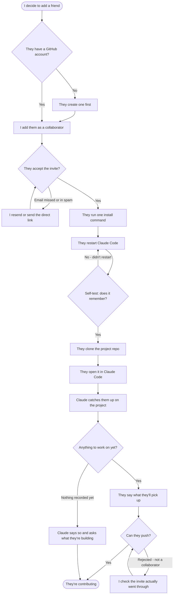

# Onboard a friend onto a shared project

- **Status:** shaping
- **Started:** 2026-08-09 by pulkit

## What this is for

**When** I've built something with `coordination-module` and want a friend building with me,
**I want to** get them from "sent a link" to "actually contributing",
**so I can** stop being the only person who decides and builds things.

**Not in scope:** teaching them git or Claude Code from scratch; managing more than a
handful of people; anyone who isn't already using Claude Code.

## The flow

## Step by step

### 1. I add them as a collaborator

- **Arrives here when:** I've decided I want help, and I have their GitHub username.
- **I do:** Settings → Collaborators → Add people.
- **System does:** Sends them an email invitation.
- **They can get it wrong by:** giving me their display name rather than their username →
  **prevented by:** telling them to send the URL of their own GitHub profile instead.
- **Allowed to do this:** repo owner only.

### 2. They accept the invite

- **Arrives here when:** the email lands.
- **Fails by:** the email going to spam, or being ignored for days. This is the single most
  common stall and it's invisible to me — GitHub shows the invite as pending, not failed.
- **We show:** nothing automatic. **I** need to notice and nudge, so the flow has to loop.
- **Assumed:** a nudge is manual. Automating a reminder isn't worth it for a handful of
  people.

### 3. They install the skills

- **They do:** paste **one** command (was two).
- **System does:** clones the tooling repo and installs all three skills. It passes the
  clone location through explicitly, so the "couldn't find your clone" failure can't happen
  any more.
- **First time they've seen it:** yes — this is their first contact with the tool, so the
  error messages carry the whole burden of teaching.

### 4. They restart Claude Code

- **Why this step exists at all:** Claude Code reads its skill list once at startup.
  Installing without restarting leaves the skills invisible, and everything downstream
  silently does nothing.
- **This is verified, not theoretical** — it happened during development and cost real
  confusion before the cause was clear. It's the highest-risk step in the whole flow
  precisely because nothing looks broken.
- **Now mitigated three ways:** the warning appears *above* the command rather than below
  it, the installer ends with an unmissable block about it, and there's a self-test —
  *"what can you remember about this project"* — that turns silent failure into a checkable
  answer. The restart itself can't be removed; only made hard to skip and easy to detect.

### 5. They open the project and get caught up

- **System does:** loads `CLAUDE.md`, reads `JOURNAL.md`/`CONTEXT.md`/`TASKS.md`, and opens
  by saying what's happened so far.
- **Empty:** a brand-new project has no ideas, no tasks, and no history. Claude should say
  so plainly and suggest adding an idea, rather than presenting an empty status report that
  reads like something is broken.
- **One / many:** with one idea it should just point at it; with many it should suggest
  `triage` rather than listing everything.

### 6. They claim something and push

- **Fails by:** push rejected because the invite was never actually accepted. The git error
  is unhelpful here — it talks about permissions, not about invitations.
- **We show:** if a push is rejected on a repo they were recently invited to, say "your
  invite may still be pending — check your email" rather than passing the raw git error
  through.

## Rules

- [x] `GETTING-STARTED.md` states the restart requirement before the install commands, not
      after them
- [x] `update_skill.sh` failing to find the repo prints the exact fix — and the installer
      now passes the location through, so it can't happen from the install path at all
- [x] Opening a freshly-scaffolded project produces a "nothing here yet" message rather
      than an empty status
- [x] A push rejection on a repo with a pending invite is explained in terms of the invite
- [ ] A friend can go from invite to first contribution without asking the owner anything

## Examples

- Friend runs the install from their home directory instead of the clone → sees "couldn't
  find your clone of the coordination-module repo" plus the `TEAM_COLLAB_REPO=` line.
- Friend installs but doesn't restart → types "catch me up", nothing happens, no error.
  This is the bad case: silence rather than a message.
- Friend opens a project scaffolded five minutes ago → "This one's just been set up —
  nothing claimed and no ideas yet. Want to add the first one?"

## Assumptions

- **Nudging about unaccepted invites stays manual** — automating it would need a scheduled
  job for a problem that affects a handful of people once. _Revisit when: more than ~5
  people, or it stalls repeatedly._
- **Everyone already has Claude Code installed and working.** _Revisit when: someone tries
  to onboard a person who doesn't._
- **`python3` exists on their machine.** True on macOS and most Linux; would break on a
  bare Windows install. _Revisit when: someone onboards on Windows._

**Riskiest:** that everyone already has Claude Code installed and working. It's untested,
it blocks every later step, and there's no evidence either way — the other two assumptions
only cost a small fix if wrong.

## Open questions

- [ ] Should a friend be able to *read* the project without being a collaborator (public
      repo) or is private-only correct? — affects how much friction step 2 causes
- [ ] Is there any way to detect "skills installed but Claude Code not restarted" and say
      so, rather than failing silently? — this is the highest-value fix in the flow

## First slice

The walking skeleton — one friend, one project, end to end:

- Fix the "nothing here yet" empty state on a freshly scaffolded project
- Make push-rejected-with-pending-invite explain itself
- Verify the restart warning is above the install commands in `GETTING-STARTED.md`

**Deferred to later:** Windows support, automated invite nudges, anything for groups
larger than about five.

**Fixed 2026-08-09, before the first real person tried it.** `check_journey` flagged ten
steps, past where people drop out. Changes: two install commands became one; the
"couldn't find your clone" failure was removed at the source; the restart warning moved
above the command and gained a self-test so it fails loudly instead of silently; and a
rejected push on a repo you were just invited to now says so rather than reporting a
permissions error. The remaining steps are genuinely irreducible — someone does have to
accept an invite, install, restart, and clone.
